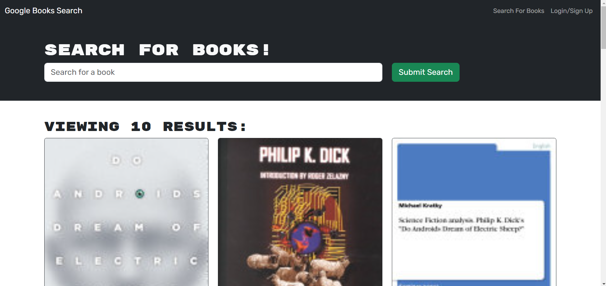

# Book Search Engine 

# Table of Contents
1. [Description](#description)
2. [Usage](#usage)
3. [Deployment](#deploy)
4. [Questions](#questions)

## Description
Simple search engine for searching and saving books.

## Usage
Use the search bar to search for books. Use the login and signup buttons to make an account.

## Deployment
You can see the app in action <a href="[link](https://book-search-6mar.onrender.com/)>here!</a>

## Questions
If you have any questions or comments, please contact me at:
[Github](https://github.com/pommerpie)
Email: pommerpie@gmail.com
